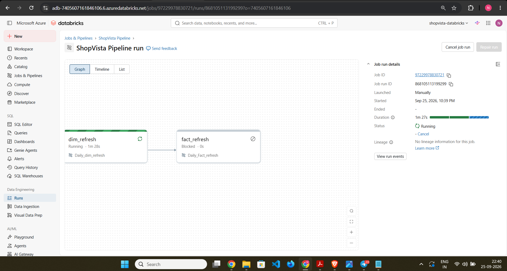
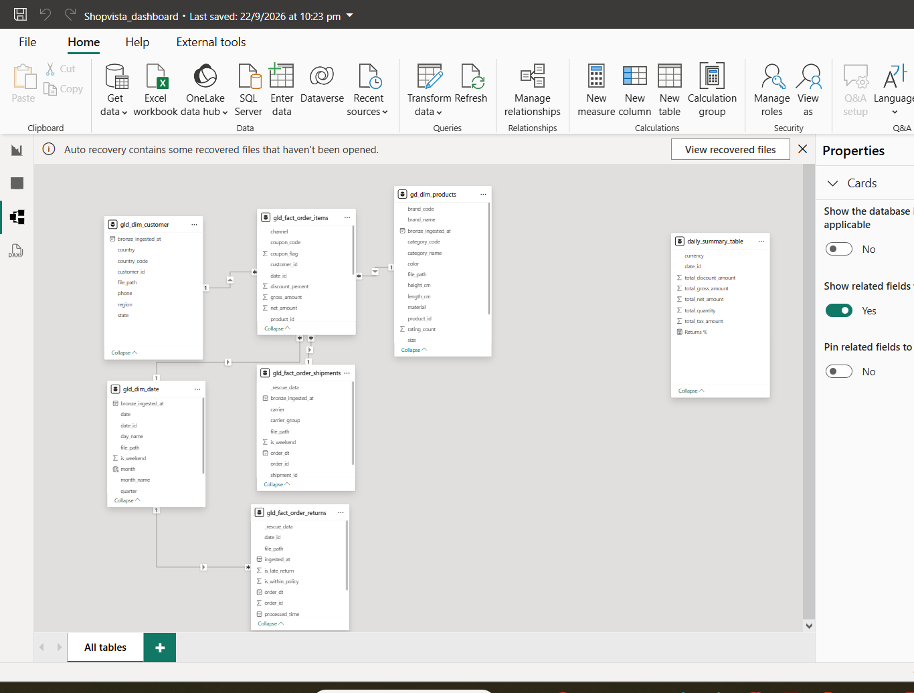
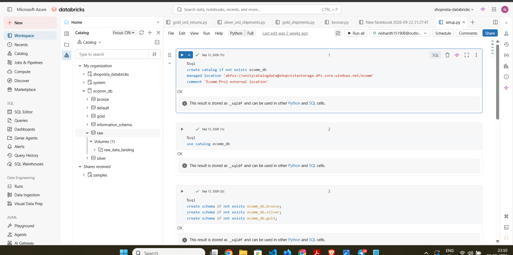
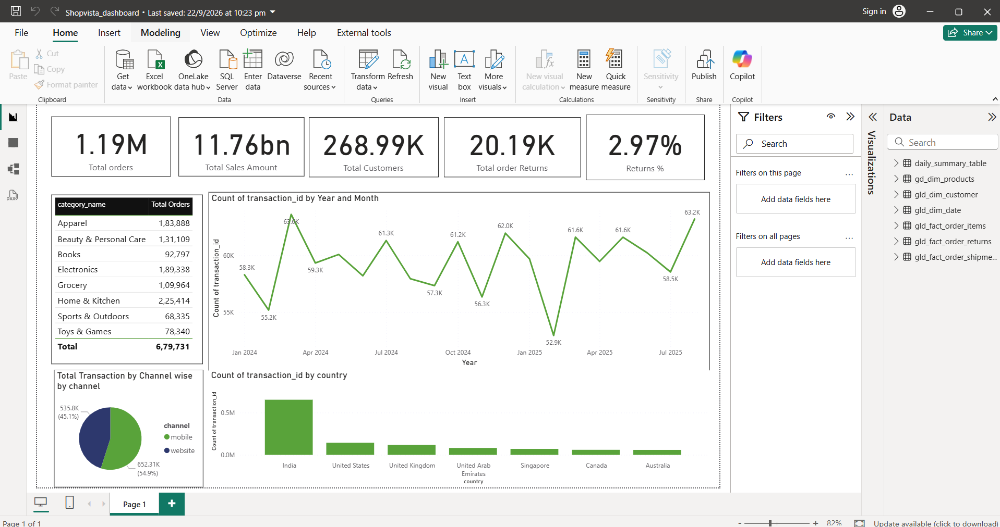

# ShopVista: End-to-End E-Commerce Lakehouse on Azure Databricks


## Problem Statement

- E-commerce operational data was fragmented across orders, shipments, returns, and master dimension files.
- Teams relied on spreadsheets and ad-hoc scripts to reconcile order, shipment, and return records.
- Revenue, return-rate, and logistics SLA reporting required multi-hour manual processing cycles.
- There was no centralized source of truth for supply-chain tracking and post-purchase customer returns.
- Historical and incremental data processing required a scalable architecture capable of handling both batch backfills and streaming updates.
- ShopVista addresses these limitations through an automated Azure Lakehouse using **Azure Data Lake Storage Gen2, Azure Databricks, Delta Lake, and Power BI**.
- The platform implements a **Bronze → Silver → Gold Medallion Architecture** with incremental processing, Delta Change Data Feed, SCD Type 1 merges, and governed storage access.

---

## End-to-End Architecture & Medallion Data Flow

>

> **Pipeline Screenshot**  
>

---

## Security & Cloud Infrastructure

### Azure Data Lake Storage Gen2

ADLS Gen2 provides the persistent storage layer for the Lakehouse.

```text
ADLS Gen2
│
├── bronze/
│   └── Raw source data
│
├── silver/
│   └── Validated and enriched Delta tables
│
└── gold/
    └── Analytics-ready dimensional model
```

The storage architecture uses hierarchical namespaces to organize data according to the Medallion layers.

### Authentication

ShopVista uses a **System-Assigned Managed Identity** through the **Azure Access Connector for Databricks**.

```text
Azure Databricks
       │
       ▼
Azure Access Connector
       │
       │ System-Assigned Managed Identity
       ▼
Microsoft Entra ID
       │
       │ RBAC authorization
       ▼
ADLS Gen2
```

No storage account keys, SAS tokens, or hardcoded credentials are required in notebooks.

### RBAC

The Managed Identity is granted:

```text
Storage Blob Data Contributor
```

at the appropriate ADLS Gen2 container/storage scope.

### Unity Catalog

Unity Catalog External Locations provide governed access to ADLS Gen2 paths.

```text
Unity Catalog
     │
     └── External Location
             │
             └── abfss://<container>@<storage-account>.dfs.core.windows.net/
```

The architecture uses `abfss://` URIs rather than embedding storage credentials.

---

## Data Modeling: Snowflake Schema Design

The Gold layer uses a normalized **Snowflake Schema** to reduce redundancy and separate reusable business dimensions from transactional facts.

### Gold Data Model

```text
                         ┌──────────────────────┐
                         │    dim_categories    │
                         │──────────────────────│
                         │ category_code (PK)   │
                         │ category_name        │
                         └──────────┬───────────┘
                                    │
                         ┌──────────▼───────────┐
                         │      dim_brands      │
                         │──────────────────────│
                         │ brand_code (PK)      │
                         │ brand_name           │
                         │ category_code (FK)   │
                         └──────────┬───────────┘
                                    │
                         ┌──────────▼───────────┐
                         │     dim_products     │
                         │──────────────────────│
                         │ product_id (PK)      │
                         │ sku                  │
                         │ price                │
                         │ category_code (FK)   │
                         └──────────┬───────────┘
                                    │
                  ┌─────────────────┼─────────────────┐
                  │                 │                 │
                  ▼                 ▼                 ▼
       ┌──────────────────┐ ┌──────────────────┐ ┌──────────────────┐
       │fact_order_items  │ │fact_order_       │ │fact_order_      │
       │                  │ │shipments         │ │returns          │
       │ order_id         │ │ order_id         │ │ return_id       │
       │ item_id          │ │ shipment_id      │ │ order_id        │
       │ product_id (FK)  │ │ carrier          │ │ product_id (FK) │
       │ pricing          │ │ carrier_group    │ │ refund_amount   │
       │ discounts        │ │ order_dt         │ │ return_turnaround│
       └──────────────────┘ └──────────────────┘ └──────────────────┘

       ┌──────────────────────┐       ┌──────────────────────┐
       │    dim_customers     │       │       dim_date       │
       │──────────────────────│       │──────────────────────│
       │ customer_id (PK)     │       │ date_key (PK)        │
       │ email                │       │ year                 │
       │ shipping_address     │       │ month                │
       │ registration metadata│       │ quarter              │
       └──────────────────────┘       │ day_of_week          │
                                      │ is_weekend           │
                                      └──────────────────────┘
```

> **Snowflake Schema Screenshot**
>  

### Gold Schema Directory

| Table | Type | Primary Key | Important Attributes | Purpose |
|---|---|---|---|---|
| `dim_categories` | Dimension | `category_code` | `category_name` | Product category master |
| `dim_brands` | Dimension | `brand_code` | `brand_name`, `category_code` | Brand hierarchy |
| `dim_products` | Dimension | `product_id` | `sku`, `price`, `category_code` | Product master |
| `dim_customers` | Dimension | `customer_id` | `email`, shipping address, registration metadata | Customer master |
| `dim_date` | Dimension | `date_key` | `year`, `month`, `quarter`, `day_of_week`, `is_weekend` | Calendar dimension |
| `fact_order_items` | Fact | `order_id`, `item_id` | `product_id`, line-item pricing, discounts | Order-item transactions |
| `fact_order_shipments` | Fact | `order_id`, `shipment_id` | `carrier`, `carrier_group`, `order_dt` | Shipment and logistics events |
| `fact_order_returns` | Fact | `return_id` | `order_id`, `product_id`, refund amounts, return turnaround | Product return transactions |

### Key Relationships

```text
dim_categories
      │
      ├────────────── dim_brands
      │                    │
      └────────────── dim_products
                           │
                           ├────────────── fact_order_items
                           │
                           └────────────── fact_order_returns

dim_customers ───────────────▶ Order domain

dim_date ────────────────────▶ Transaction / shipment / return dates

fact_order_items
        │
        ├──────────────▶ Revenue analysis
        └──────────────▶ Product analysis

fact_order_shipments
        │
        └──────────────▶ Carrier SLA analysis

fact_order_returns
        │
        └──────────────▶ Return pattern analysis
```

---

## Medallion Pipeline Implementation

### Bronze Layer

The Bronze layer ingests raw source files using **Databricks Auto Loader** with the `cloudFiles` source.

Key capabilities:

- Incremental file discovery.
- Schema inference.
- Schema tracking.
- Persistent metadata using `cloudFiles.schemaLocation`.
- Automatic handling of malformed records through `_rescued_data`.
- Raw data preservation for downstream reprocessing.

```text
Source Files
     │
     ▼
Databricks Auto Loader
     │
     ├── Schema Inference
     ├── Schema Tracking
     └── Corrupt Record Handling
     │
     ▼
Bronze Delta Tables
```

### Silver Layer

The Silver layer converts raw Bronze data into validated and business-ready Delta datasets.

Processing includes:

- Schema enforcement.
- Data type standardization.
- Null filtering.
- Record deduplication.
- Business rule enrichment.
- Carrier classification.
- Return turnaround calculation.
- Delta Change Data Feed activation.

Example business enrichment:

```text
carrier
   │
   ├── Domestic
   └── International
        │
        ▼
carrier_group
```

Return turnaround:

```text
datediff(return_date, order_date)
                │
                ▼
       Return turnaround window
```

Delta CDF is enabled with:

```sql
ALTER TABLE silver_table
SET TBLPROPERTIES (
    delta.enableChangeDataFeed = true
);
```

### Gold Layer

Gold processing consumes Silver Delta Change Data Feed records incrementally.


The pipeline uses:

- `readStream`
- Delta Change Data Feed
- `foreachBatch`
- `MERGE`
- SCD Type 1 semantics
- Micro-batch deduplication
- Partition pruning
- `availableNow=True`

> **Databricks Sample Notebook Screenshot**  
> 

> **SCD Implementation Screenshot**  
> `docs/screenshots/scd_implementation.png`

---

## Key Engineering Solutions & PySpark Code

### 1. Bronze Ingestion with Auto Loader


### 2. Silver-to-Gold CDF Processing


### 3. SCD Type 1 `MERGE` with `foreachBatch`


#### `availableNow=True`

The pipeline uses:

```python
.trigger(availableNow=True)
```

to process all currently available data and then terminate.

```text
Scheduled Job
     │
     ▼
Start Stream
     │
     ▼
Process Available CDF
     │
     ▼
Commit Delta Changes
     │
     ▼
Terminate
```

This provides a scheduled incremental execution model without requiring continuously running streaming compute.

---

## Data Volumes & Execution Strategy

| Dataset | Historical Processing | Incremental Processing | Volume / Strategy |
|---|---|---|---|
| `fact_order_items` | `2024-01-01` → `2024-08-31` | `2025-09-01` → `2025-12-31` | 1,000,000+ total rows; historical Auto Loader backfill followed by daily incremental streaming |
| `fact_order_shipments` | `2024-01` → `2025-08` | `2025-09` → `2025-12` | Month-over-Month historical backfill followed by incremental streaming |
| `fact_order_returns` | `2024-01` → `2025-08` | `2025-09` → `2026-01` | Month-over-Month historical backfill followed by incremental streaming |

### Historical Backfill Strategy

Large historical ranges are processed in controlled periods rather than treating the entire history as a single workload.

```text
2024-01
   │
2024-02
   │
2024-03
   │
 ...
   │
2025-08
   │
   ▼
Historical Gold Baseline
```

For shipments and returns, the historical pipeline follows a **Month-over-Month (MoM)** execution strategy.

### Incremental Strategy

After historical initialization:

```text
Historical Backfill
       │
       ▼
Gold Baseline
       │
       ▼
Delta CDF
       │
       ▼
Scheduled Incremental Processing
       │
       ▼
SCD Type 1 MERGE
```

### Compute Cost Control

`availableNow=True` allows the pipeline to process currently available incremental data as a finite workload.

```text
Scheduled Trigger
      │
      ▼
Available Data
      │
      ▼
Process
      │
      ▼
Stop Compute
```

This reduces unnecessary compute runtime for workloads that do not require continuously active streaming infrastructure.

---

## Analytics & BI Dashboards

Power BI consumes the **Gold Delta tables** to provide analytical reporting across three primary domains.


> **Power BI Dashboard Screenshot**  
> 

---


